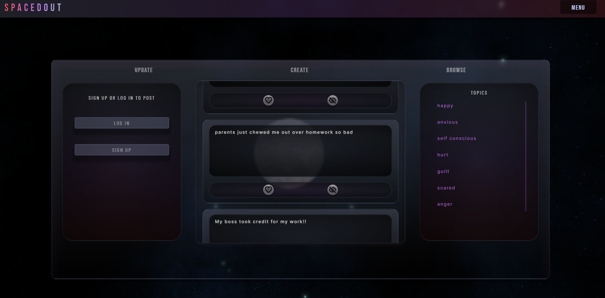

# spacedout

'spacedout' aims to be a mental health anti-social social media web app.

A general idea of the project can be surmised by the user story:

As a user I can:
- Make a post about a problem, feeling etc. in confidence
- I can see how many other users have indicated that they also experience the contents of my posts
- View posts from other users and indicate whether I experience the contents of a post
- Hide other user's posts I do not want to see
- Delete or edit my own posts

The idea behind space your problems is not to replace therapy or other professional assistance services. 
The space the app is envisioned to occupy is one of a sort of catharsis tool, a user may vent/be vulernable in a safe environment and have the opportunity to feel validated as well.


## Authors

- [@stevedusome](https://www.github.com/stevedusome)
- [@Tinastouch](https://github.com/Tinastouch)
- [@charlestietjen](https://www.github.com/charlestietjen)
- [@HazShk](https://github.com/HazShk)
## License

[MIT](https://choosealicense.com/licenses/mit/)


## Screenshots




## Deployed Application

[Deployed spacedout](https://spaced-problems.herokuapp.com/)
## Installation

To install the application locally, run:

```bash
'npm i'
``` 
This will install all dependencies required to run the application.

Required modules can be reviewed in the package.json.
## Environment Variables

To run this project, you will need to add the following environment variables to your .env file

`DB_NAME='spacedout_db'`
`DB_USER='root'`
`DB_PW='password'`
`SECRET='asecret'`
`API_KEY='secretkey'`

Where DB_NAME is an existing SQL database and user/password are valid SQL credentials. SECRET and API_KEY are non-optional but can be set to any value.


## Run Locally

Lastly run the server with:

```bash
npm start
```

Navigate to either http://localhost:3001/ if running locally, or the domain and port the application is listening on. 
## Roadmap

- User maintenance area, allow a user to edit their own account information, view and manage a list of hidden posts.
- Moderation, build a moderator and admin account system with post reporting functions along with them.